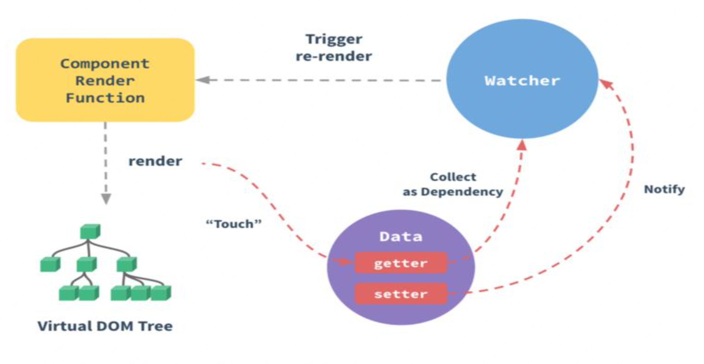

# Vue
## 1. Vue 的基本原理
  当一个Vue 实例创建时，Vue 会遍历 data 中的属性，用 Object.defineProperty ( vue3.0 使 用 proxy ) 将 它 们 转 为 getter/setter，并且在内部追踪相关依赖，在属性被访问和修改时 通知变化。 每个组件实例都有相应的 watcher 程序实例，它会在组 件渲染的过程中把属性记录为依赖，之后当依赖项的 setter 被调用 时，会通知 watcher 重新计算，从而致使它关联的组件得以更新。
  

## 2. 双向数据绑定的原理

    Vue.js 是采用数据劫持结合发布者-订阅者模式的方式，通过 Object.defineProperty()来劫持各个属性的 setter，getter，在数 据变动时发布消息给订阅者，触发相应的监听回调。主要分为以下几 个步骤

    1.需要 observe 的数据对象进行递归遍历，包括子属性对象的属性， 都加上 setter 和 getter 这样的话，给这个对象的某个值赋值，就会 触发 setter，那么就能监听到了数据变化

    2.compile 解析模板指令，将模板中的变量替换成数据，然后初始化 渲染页面视图，并将每个指令对应的节点绑定更新函数，添加监听数 据的订阅者，一旦数据有变动，收到通知，更新视图

    3.Watcher 订阅者是 Observer 和 Compile 之间通信的桥梁，主要做 的事情是: 1在自身实例化时往属性订阅器(dep)里面添加自己 2 自身必须有一个 update()方法 3待属性变动 dep.notice()通知时， 能调用自身的 update()方法，并触发 Compile 中绑定的回调，则功 成身退。

    4.MVVM 作为数据绑定的入口，整合 Observer、Compile 和 Watcher 三者，通过 Observer 来监听自己的 model 数据变化，通过 Compile 来解析编译模板指令，最终利用 Watcher 搭起 Observer 和 Compile 之间的通信桥梁，达到数据变化 -> 视图更新;视图交互变化(input) -> 数据 model 变更的双向绑定效果。